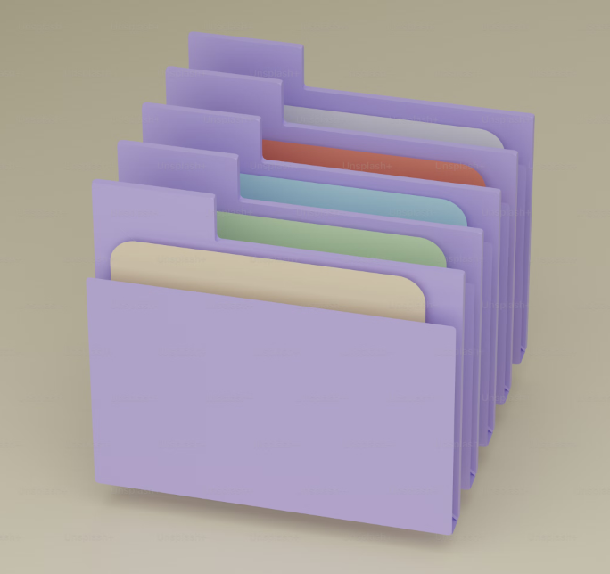

<div align='center'>

# Template

</div>
<div align='center'>
    <h3>💻 Languages</h3>
    
    
    
    <h3>🔧 Technologies</h3>
    
    
    
    
    
    
    
    
    
    
    
    
    <!-- <h4><a href="https://asdacosta.github.io/###/">Live Preview</a></h4> -->
</div>

**Demo:**


<!--  -->

<details>

**<summary>Screen views</summary>**

**Desktop View:**

<!--  -->
<br>

**Mobile View:**


</details>

## 🌐 Origin

<!-- [The Odin Project](https://www.theodinproject.com/) -->

## 📝 Description

Store all template files.

<details>
<summary>Features</summary>

- ###

</details>

## 🎯 Relevance

To solidify concepts of `###` in ###.

## 👥 Intended Audience

Developers, users, recruiters.

> [!NOTE]
> Users can install all dependencies using `package.json` file via:
>
> ```bash
> npm install
> ```

## 📂 Files

<details>
<summary>Invert</summary>

| File              | Description                                                                                                                                                             |
| ----------------- | ----------------------------------------------------------------------------------------------------------------------------------------------------------------------- |
| `src/*`           | Source files that are bundled into the output directory `dist/`.                                                                                                        |
| `src/index.js`    | The main JavaScript entry point that bundling begins.                                                                                                                   |
| `dist/*`          | Output files from bundling of files in directory `src/`.                                                                                                                |
| `dist/main.js`    | Main JavaScript output file that contains the bundled JavaScript code. Code is minified and optimized for deployment (Due to mode set to production in webpack config). |
| `package*`        | Contains details of project and dependencies versions.                                                                                                                  |
| `algorithm.txt`   | Algorithm for `JavaScript`.                                                                                                                                             |
| `readme-assets/*` | Live demo and different screen views used in `README.md`.                                                                                                               |

</details>

## ©️ Credit

<details>
<summary>Invert</summary>

| File             | Description                      |
| ---------------- | -------------------------------- |
| `src/assets/###` | Photo created by ### on [###](). |

</details>

## 🔄 Improvements

<details>
<summary>Invert</summary>

- [ ] ###

</details>

## 👤 Curator

1. [Abraham Da Costa Silvanus](https://github.com/asdacosta)

<br>

> [!IMPORTANT]
> Seek contributor's consent for any code usage.

**[🞁 Top](#template)**
